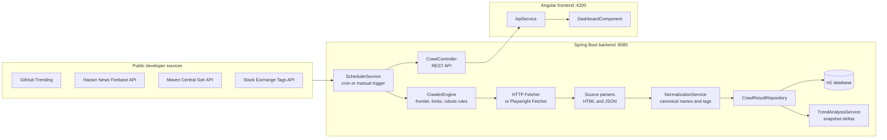
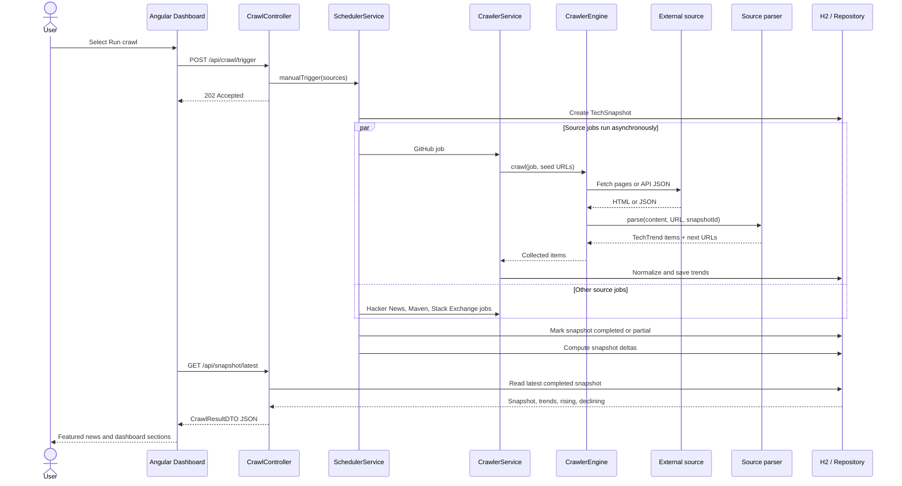
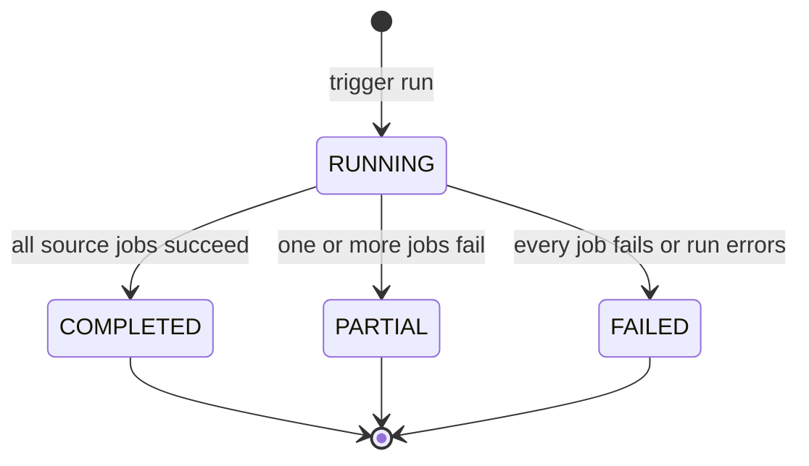
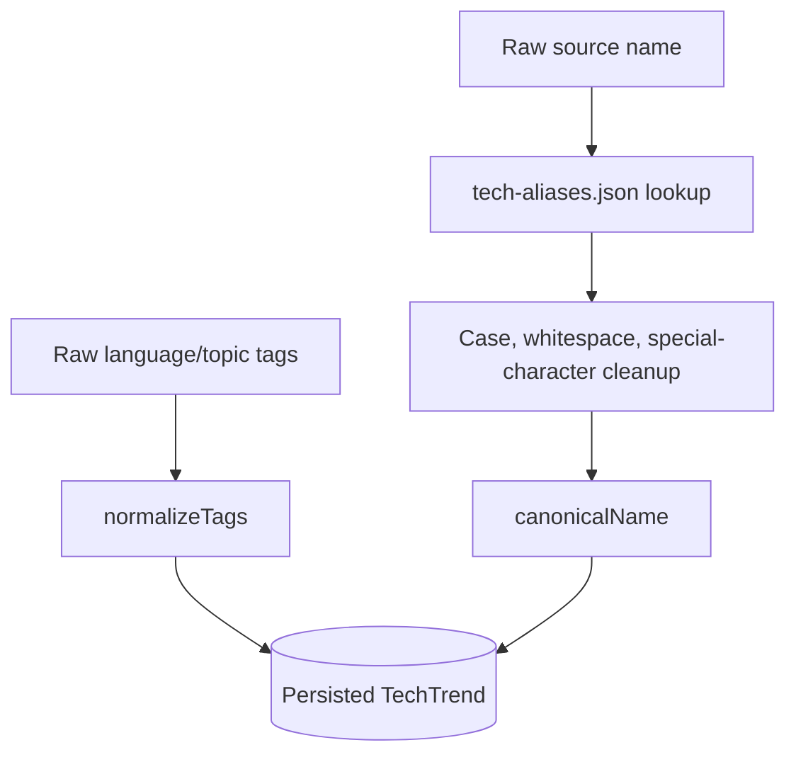

# Neural Crawler

> A developer ecosystem radar for discovering what is moving across GitHub, Hacker News, Maven Central, and Stack Overflow

[](https://www.oracle.com/java/technologies/javase/jdk21-archive-downloads.html)
[](https://spring.io/projects/spring-boot)
[](https://angular.dev/)
[](https://jsoup.org/)
[](https://www.h2database.com/)

**Collect. Normalize. Compare. Explore.**

---

## Contents

- [What It Does](#what-it-does)
- [Architecture](#architecture)
- [Data Flow](#data-flow)
- [Source Connectors](#source-connectors)
- [Dashboard Experience](#dashboard-experience)
- [Project Structure](#project-structure)
- [Requirements](#requirements)
- [Quick Start](#quick-start)
- [Configuration](#configuration)
- [REST API](#rest-api)
- [Data Model](#data-model)
- [Exports](#exports)
- [Testing](#testing)
- [Operational Notes](#operational-notes)
- [Roadmap](#roadmap)

## What It Does

Neural Crawler periodically builds a snapshot of developer-technology activity from several public sources. It turns heterogeneous HTML and JSON responses into one normalized `TechTrend` model, stores each result against a crawl snapshot, calculates movement between snapshots, and presents the latest signals in an Angular dashboard.

The application is designed to answer questions such as:

- Which technologies and repositories are appearing in current developer activity?
- What stories are gaining attention on Hacker News?
- Which libraries are visible in Maven Central search results?
- Which languages and repositories are active on GitHub Trending?
- Which technologies are rising or declining compared with the previous snapshot?
- Can the collected snapshot be downloaded as CSV or JSON?

The current dashboard is news-first: the latest Hacker News signal is presented as a featured story, followed by a capped news feed, community signals, GitHub language activity, trend movement, and the complete crawl table.

> **Important source note:** the enum is named `STACKOVERFLOW_JOBS`, but the current scheduler supplies the Stack Exchange popular-tags API to that parser. The application therefore currently presents that data as **Jobs & community signals**, not as verified job postings.

## Architecture

The repository is split into two applications:

- `neural-crawler/` is the Spring Boot backend. It schedules and runs crawls, fetches source data, parses responses, normalizes technology names, persists snapshots, computes deltas, and exposes REST endpoints.
- `frontend/` is the active Angular dashboard. It calls the backend through the `/api` development proxy and turns the flat snapshot response into the news, jobs/community, languages, movement, and full-data views.



### Runtime responsibilities

| Layer | Responsibility |
| --- | --- |
| Scheduler | Starts a complete run every six hours by default or starts one immediately from the dashboard. |
| Crawler engine | Maintains a per-source URL frontier, prevents duplicate visits, enforces page limits, checks robots rules, and supports cancellation. |
| Fetchers | Uses Apache HttpClient for normal requests and Playwright when a JavaScript-rendered fetch is needed. |
| Parsers | Converts source-specific HTML or JSON into `TechTrend` records and optional follow-up URLs. |
| Normalization | Maps aliases from `tech-aliases.json`, cleans names, and normalizes tags. |
| Persistence | Stores snapshots, crawl jobs, trends, tags, and source metadata in H2 through Spring Data JPA. |
| Analysis | Compares completed snapshots and produces rising/declining trend deltas. |
| REST API | Provides crawl controls, snapshot data, trend data, and exports. |
| Angular dashboard | Presents the latest snapshot as a readable, news-first interface. |

## Data Flow

A crawl is asynchronous. The trigger endpoint returns `202 Accepted`, while the scheduler performs the actual work in the background.



### Snapshot lifecycle



Each trend is linked to a `snapshotId`. This makes it possible to compare a completed crawl with an earlier crawl instead of mixing records from different collection times.

## Source Connectors

### GitHub Trending

- **Parser:** `GitHubTrendingParser`
- **Input:** Trending repository pages
- **Output:** Repository name, description, primary language, topics, star count, and GitHub URL
- **Follow-up behavior:** Discovers language-filter links as additional crawl URLs
- **Optional rendering:** Can use Playwright when `radar.sources.github.use-playwright=true`

### Hacker News

- **Parser:** `HackerNewsApiParser`
- **Input:** Official Firebase endpoints for top stories and Ask HN stories
- **Output:** Story title or detected technology keyword, score, author, comment count, and Hacker News item URL
- **Limit:** Up to 50 story IDs are expanded per list response
- **Safety:** Story text is sanitized before storage

### Maven Central

- **Parser:** `MavenCentralParser`
- **Input:** Maven Central Solr search JSON
- **Output:** Artifact name, group/artifact coordinates, latest version, version count, and artifact URL
- **Pagination:** Builds a follow-up URL when more search results are available
- **Adoption signal:** Version count is stored as a download-style metric because the source response does not provide downloads here

### Stack Exchange community signals

- **Parser:** `StackOverflowJobsParser`
- **Current input:** Stack Exchange popular-tags API
- **Output:** Popular technology tags and question counts
- **Dashboard label:** Jobs & community signals

## Dashboard Experience

The Angular dashboard is intentionally organized for scanning and reading rather than showing raw metadata first.

1. **Featured latest news** shows the first current Hacker News signal with its topic, description, source, and a link to the original item.
2. **News worth reading** displays the remaining Hacker News records, capped at 50 total news items.
3. **Jobs & community signals** displays up to 10 Stack Exchange-derived records with their source links.
4. **Languages to watch** displays up to 10 GitHub language records with stars and GitHub links.
5. **Trend shifts** shows rising and declining technology movement when a previous snapshot exists.
6. **All collected signals** keeps the complete snapshot available in a source-linked table.
7. **Last crawl** is shown in the header. Detailed snapshot status, item totals, and snapshot IDs are intentionally not placed in the primary reading flow.

The frontend derives its sections from the flat `CrawlResultDTO.trends` array using source and category fields. The backend currently does not return separate `news`, `jobs`, or `languages` collections.

## Project Structure

```text
Neural-Crawler-Web-Crawler/
├── frontend/                         # Angular 18 dashboard
│   ├── src/app/components/dashboard/ # News-first dashboard UI
│   ├── src/app/services/api.service.ts
│   ├── src/environments/             # API URL configuration
│   ├── proxy.conf.json               # /api -> localhost:8080 in development
│   └── package.json
│
├── neural-crawler/                   # Spring Boot backend
│   ├── src/main/java/com/neuralcrawler/
│   │   ├── controller/               # REST and UI controllers
│   │   ├── crawler/                  # Fetching, robots, crawl engine
│   │   ├── dao/                      # Persistence/repositories
│   │   ├── dto/                      # API response/request objects
│   │   ├── export/                   # CSV and JSON exports
│   │   ├── model/                    # JPA entities and enums
│   │   ├── parser/                   # GitHub, HN, Maven, Stack Exchange parsers
│   │   ├── service/                  # Scheduling, normalization, analysis
│   │   └── util/                     # URL and request safety helpers
│   ├── src/main/resources/
│   │   ├── application.properties   # Main runtime configuration
│   │   ├── application-dev.properties
│   │   └── tech-aliases.json         # Technology normalization aliases
│   ├── src/test/java/                # Backend tests
│   ├── pom.xml
│   └── mvnw
│
└── README.md
```

## Requirements

- Java 21
- Maven 3.9+ or the included Maven Wrapper
- Node.js 18.19+ or a current LTS release
- npm
- Internet access to the configured public source APIs/pages
- Chromium binaries only when Playwright fetching is enabled

## Quick Start

### 1. Start the backend

```bash
cd neural-crawler
./mvnw spring-boot:run
```

The API starts on `http://localhost:8080`.

On Windows, use:

```powershell
cd neural-crawler
mvnw.cmd spring-boot:run
```

### 2. Start the Angular dashboard

Open a second terminal:

```bash
cd frontend
npm install
npm start
```

Open `http://localhost:4200`.

The Angular development proxy forwards `/api` requests to `http://localhost:8080`, so the browser does not need a separate API base URL during local development.

### 3. Run the first crawl

Use the **Run crawl** button, or call the API directly:

```bash
curl -X POST http://localhost:8080/api/crawl/trigger \
  -H 'Content-Type: application/json' \
  -d '{}'
```

Then inspect the latest completed snapshot:

```bash
curl http://localhost:8080/api/snapshot/latest
```

## Configuration

Main configuration lives in `neural-crawler/src/main/resources/application.properties`.

| Setting | Default | Purpose |
| --- | --- | --- |
| `server.port` | `8080` | Backend HTTP port |
| `radar.schedule.enabled` | `true` | Enables scheduled runs |
| `radar.schedule.cron` | `0 0 0/6 * * *` | Runs every six hours |
| `radar.sources.github.urls` | GitHub Trending URLs | GitHub seed pages |
| `radar.sources.hackernews.api-url` | HN top stories API | Hacker News list endpoint |
| `radar.sources.hackernews.ask-url` | HN Ask API | Additional HN list endpoint |
| `radar.sources.maven.api-url` | Maven Solr query | Maven search endpoint |
| `radar.sources.stackoverflow.feed-urls` | Job-feed values | Legacy configuration; current scheduler uses Stack Exchange API |
| `crawler.max-pages-per-source` | `20` | Per-source crawl page limit |
| `crawler.rate.*` | See properties | Request delay and concurrency controls |
| `crawler.robots.enabled` | `true` | Robots policy behavior |
| `radar.normalization.map-file` | `tech-aliases.json` | Alias mapping file |
| `spring.datasource.url` | H2 in-memory URL | Development database |
| `playwright.headless` | `true` | Headless browser mode |

### Database behavior

The default database is H2 in-memory:

```properties
spring.datasource.url=jdbc:h2:mem:neuralcrawler
```

This is convenient for development, but data disappears when the backend stops. For persistent deployments, replace the datasource properties with a supported persistent database configuration and review the JPA schema strategy before deploying.

The H2 console is enabled at `http://localhost:8080/h2-console` in the default configuration.

## REST API

All REST endpoints are rooted at `/api`.

| Method | Endpoint | Description |
| --- | --- | --- |
| `POST` | `/crawl/trigger` | Starts an asynchronous full crawl. Optional body: `{ "sources": ["GITHUB", "MAVEN_CENTRAL"] }`. |
| `DELETE` | `/crawl/{jobId}` | Sends a cancellation signal to a source job. |
| `GET` | `/snapshot/latest?topN=10` | Returns the latest completed snapshot, trends, and movement data. |
| `GET` | `/snapshot/{snapshotId}?topN=10` | Returns a specific snapshot. |
| `GET` | `/trends` | Returns the full trend list for the latest completed snapshot. |
| `GET` | `/trends/rising?limit=10` | Returns rising technologies. |
| `GET` | `/trends/declining?limit=10` | Returns declining technologies. |
| `GET` | `/export/csv?snapshotId=...&includeDeltas=false` | Downloads CSV data. |
| `GET` | `/export/json?snapshotId=...&includeDeltas=true` | Downloads JSON data. |

### Latest snapshot response shape

```json
{
  "snapshotId": "snapshot-id",
  "triggeredBy": "MANUAL",
  "startedAt": "2026-09-09T10:00:00",
  "snapshotAt": "2026-09-09T10:03:14",
  "sourcesRan": ["GITHUB", "HACKERNEWS_API", "MAVEN_CENTRAL"],
  "status": "COMPLETED",
  "totalItems": 120,
  "trends": [],
  "topRising": [],
  "topDeclining": []
}
```

## Data Model

The central entity is `TechTrend`:

| Field | Meaning |
| --- | --- |
| `canonicalName` | Normalized technology or signal name used for grouping and display |
| `rawName` | Name captured directly from the source |
| `category` | Language, library, framework, tool, platform, database, and similar categories |
| `source` | GitHub, Hacker News, Maven Central, or Stack Exchange source enum |
| `sourceUrl` | Link back to the originating repository, story, tag, or artifact |
| `starCount` | GitHub-style popularity signal |
| `mentionCount` | Story score, question count, or another mention-style signal |
| `downloadCount` | Source-specific adoption metric; Maven currently uses version count as a proxy |
| `tags` | Normalized topics and language labels |
| `description` | Human-readable source context |
| `snapshotId` | Parent crawl snapshot |
| `snapshotAt` | Collection timestamp |

Normalization happens after parsing and before persistence:



## Exports

The export service can produce:

- **CSV** for spreadsheets and lightweight analysis
- **JSON** for integrations, backups, and programmatic processing
- Optional delta data when `includeDeltas=true`
- A specific snapshot when `snapshotId` is supplied, otherwise the latest completed snapshot

Example:

```bash
curl -OJ 'http://localhost:8080/api/export/json?includeDeltas=true'
curl -OJ 'http://localhost:8080/api/export/csv?includeDeltas=false'
```

## Testing

### Backend

```bash
cd neural-crawler
./mvnw test
```

The backend test suite covers crawler lifecycle behavior and parser behavior, including GitHub, Hacker News HTML, and Maven-related cases.

### Frontend build

```bash
cd frontend
npm run build
```

### Frontend unit tests

```bash
cd frontend
npm test
```

The Angular project uses Karma/Jasmine. Tests run in a browser environment and may require a local Chrome/Chromium installation.

## Operational Notes

- Only one top-level radar run is allowed at a time. A second trigger receives a conflict response while a run is active.
- Source jobs run asynchronously and in parallel after a snapshot is created.
- The crawler uses a per-job stop flag, so cancellation does not share mutable state across unrelated source jobs.
- Robots checks apply to normal web sources. API-oriented sources bypass the robots check through the crawler's source classification.
- Page traversal is bounded by `crawler.max-pages-per-source` and source-specific follow-up behavior.
- A partial snapshot is still available to the dashboard when at least one source succeeds.
- The Angular UI caps its news presentation at 50 and jobs/language presentations at 10, while retaining the complete snapshot table below.
- Public source structures and rate limits can change. Parser selectors and source-specific assumptions may need maintenance over time.

## Roadmap

Potential next steps for the project include:

- Replace the current Stack Exchange community connector with a dedicated jobs provider if job postings are required.
- Add typed Angular response models instead of `any` in the dashboard service.
- Move presentation caps into explicit backend query parameters for lower payload sizes.
- Add pagination or virtual scrolling to the complete trend table.
- Add persistent database profiles for production deployments.
- Add integration tests for the REST controller and full crawl response.
- Add richer source health reporting without placing operational metadata in the primary reading flow.

---

Built with Java, Spring Boot, Jsoup, Playwright, Angular, and a healthy respect for public-source rate limits.
